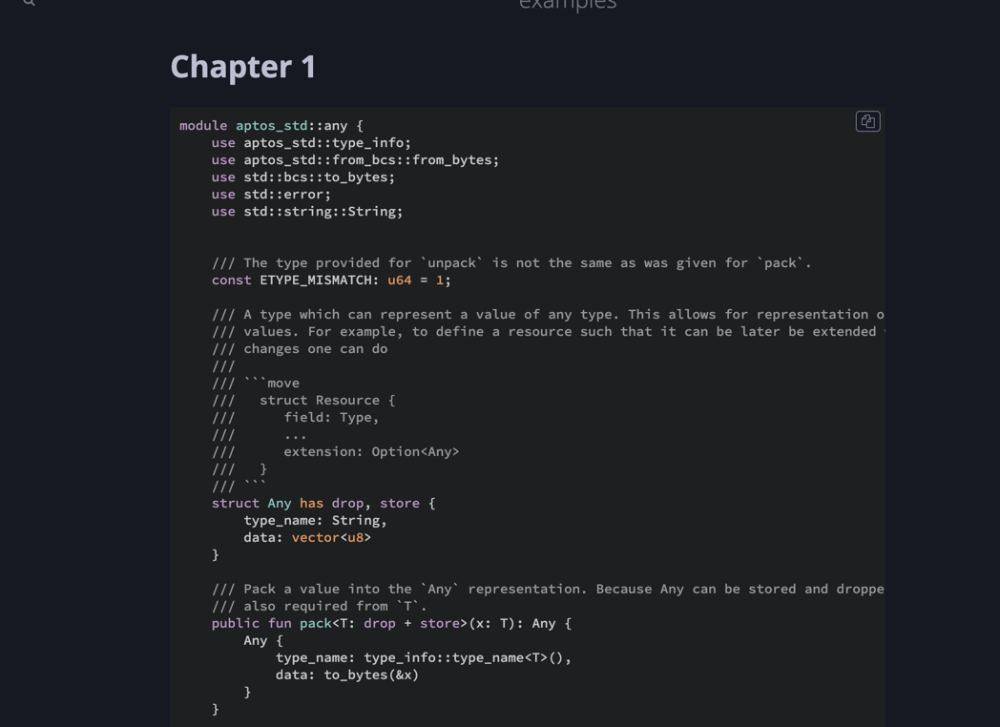

# How to use?

## install mdbook
* [github](https://github.com/rust-lang/mdBook)
* Installation tutorial reference [mdBook installation](https://rust-lang.github.io/mdBook/guide/installation.html)

## create project

```shell
mkdir aptos-book
cd aptos-book
mdbook init
```

## put js into project
-  put `move.js` into `misc` dir
-  put `highlight.js` into `theme` dir

You can see this repo for an example:

[aptos-book](aptos-book)

##   move code use Move syntax segment

\```move
    /// move code
\```


## run project

```shell
    mdbook serve
```




